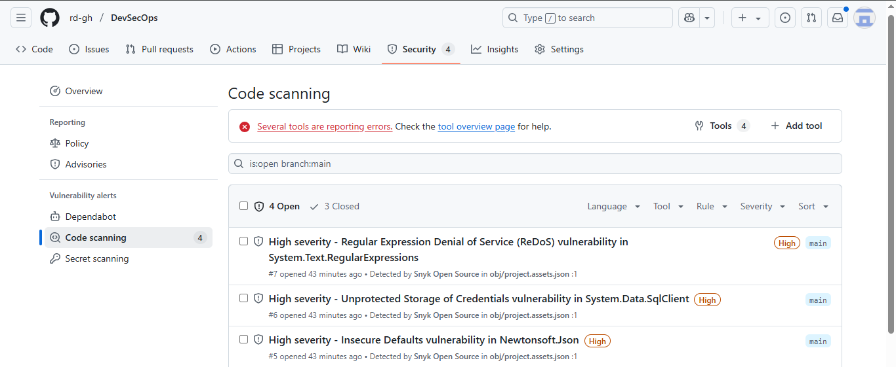
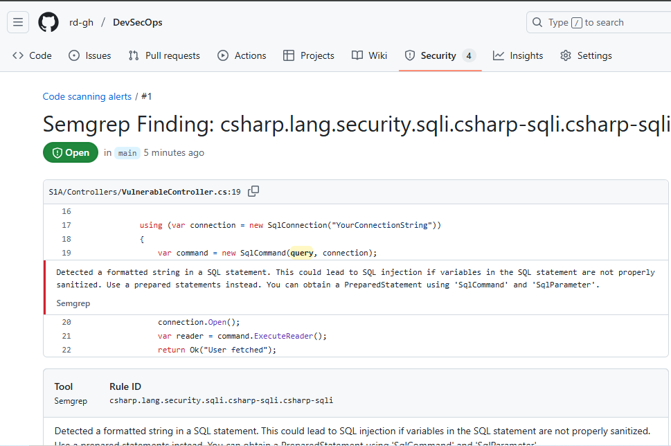
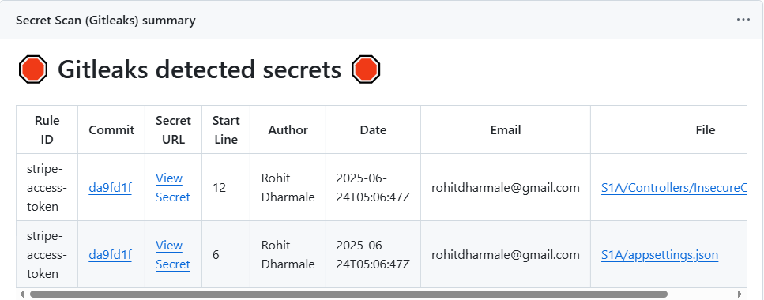
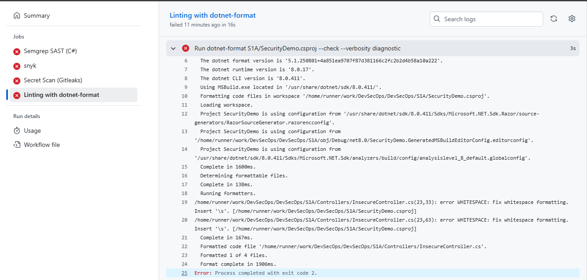

# 🛡️ SecurityDemo: .NET Core App with GitHub Security Pipeline

This repository showcases a real-world **DevSecOps pipeline** for a .NET Core application using **GitHub Actions**. It integrates modern security tools for **early detection of vulnerabilities**, **secret leakage prevention**, and **code quality enforcement** — all directly within your CI/CD workflow.

---

## 🛡️ Security Tools Implemented

| Tool             | Purpose                               | Trigger Events              |
|------------------|----------------------------------------|-----------------------------|
| 🧪 **Snyk**         | Dependency vulnerability scanning      | ✅ Push to `main`<br>✅ PR to `main` |
| 🔍 **Semgrep**      | Static Application Security Testing (SAST) | ✅ Push to `main`<br>✅ PR to `main` |
| 🔐 **Gitleaks**     | Secret detection in source code        | ✅ Push to `main`<br>✅ PR to `main` |
| 🧹 **dotnet-format**| Code formatting and linting            | ✅ Push to `main`<br>✅ PR to `main` |

📂 **Workflow Location**:  
`.github/workflows/security.yml`

---

## 🔧 Configuration Details

### ✅ **Snyk**

- **Checks**: `.csproj` and dependencies for known CVEs
- **Configuration**:
  ```yaml
  args: >
    --severity-threshold=high
    --sarif-file-output=snyk.sarif
  ```
- **Job Behavior**:
  - Fails build if high/critical CVEs are found
  - Uploads SARIF results to GitHub Code Scanning tab

> 📷 

---

### ✅ **Semgrep**

- **Purpose**: Detect insecure coding patterns in C# using customizable rules
- **Ruleset**: [`https://semgrep.dev/p/csharp`](https://semgrep.dev/p/csharp), [`https://semgrep.dev/p/owasp-top-ten`](https://semgrep.dev/p/owasp-top-ten), [`https://semgrep.dev/p/security-audit`](https://semgrep.dev/p/security-audit)
- **Flags**:
  - Use of `HttpClient` over HTTP
  - Hardcoded credentials
  - SQL Injection risk
- **Output**: SARIF uploaded to GitHub Security tab
- **Strict Mode**: Causes job to fail on finding issues

> 📷 

---

### ✅ **Gitleaks**

- **Purpose**: Detect secrets like API keys, tokens, and passwords
- **Runs On**: Push & PR to `main`
- **Behavior**:
  - Fails job on secret detection
  - Supports license key (optional) via GitHub Secrets

> 📷 

---

### ✅ **dotnet-format**

- **Purpose**: Ensure secure, clean, and consistent formatting
- **Target**: `S1A/SecurityDemo.csproj`
- **Command**:
  ```bash
  dotnet-format S1A/SecurityDemo.csproj --check --verbosity diagnostic
  ```
- **Job Behavior**:
  - Fails job if formatting issues or code hygiene issues are found

> 📷 

---

## 📊 How to Interpret the Results

| Where to Check                               | What You'll See                                |
|----------------------------------------------|-------------------------------------------------|
| 🔐 **GitHub → Security → Code Scanning Alerts** | Vulnerabilities from Semgrep and Snyk (SARIF)   |
| ⚙️ **GitHub Actions → Workflow Runs**           | Logs and job status for all tools               |
| 📦 **Artifacts** (if uploaded)                 | Optional HTML/SARIF reports to download         |

---

## 🧠 Why These Tools Were Chosen

| Tool           | Reason                                                                 |
|----------------|------------------------------------------------------------------------|
| **Snyk**       | Industry-standard for open source dependency scanning (NuGet)          |
| **Semgrep**    | Rule-based, fast static analysis — great for CI/CD                     |
| **Gitleaks**   | Prevents credential leaks before they go public                        |
| **dotnet-format** | Ensures clean, secure, and maintainable code base                    |

---

## ⚙️ Custom Rules & Configurations

| Tool           | Customizations Made                                                   |
|----------------|------------------------------------------------------------------------|
| **Snyk**       | SARIF output enabled, `--fail-on high` flag                           |
| **Semgrep**    | Strict mode enabled, SARIF upload, and custom rule source             |
| **Gitleaks**   | Environment variable support via GitHub Secret (license key optional) |
| **dotnet-format** | Targeted specific project for more precise analysis                   |

---

## 📁 Folder Structure & Proofs

```
.
├── S1A/
│   ├── SecurityDemo.csproj
│   └── Controllers/
├── .github/
│   └── workflows/
│       └── security.yml
├── assets/
│   └── images/
│       ├── snyk-proof.png
│       ├── semgrep-proof.png
│       ├── gitleaks-proof.png
│       └── dotnetformat-proof.png
└── README.md
```

---

## 📸 Visual Evidence

| Tool         | Screenshot Placeholder                                  |
|--------------|----------------------------------------------------------|
| Snyk         | `assets/images/snyk-proof.png`                          |
| Semgrep      | `assets/images/semgrep-proof.png`                       |
| Gitleaks     | `assets/images/gitleaks-proof.png`                      |
| dotnet-format| `assets/images/dotnetformat-proof.png`                  |

---

> ✅ This README is fully self-contained and reflects your actual setup — all tools run from a single `security.yml`, triggered on push & pull requests to `main`.