# 🔐 GitLab as a DevSecOps Platform

GitLab is a **complete DevSecOps and software delivery platform** that unifies the entire software lifecycle — from **planning and issue tracking** to **secure CI/CD and monitoring**. It enables teams to plan work using **issues, epics, and roadmaps**, while embedding **security scans and compliance** directly into the developer workflow. With everything in one place, GitLab empowers teams to deliver software **faster, more securely, and collaboratively**.

---

## 🚀 Built-in Security Features

GitLab integrates security scanning directly into CI/CD pipelines with minimal setup:

- **[SAST](https://docs.gitlab.com/ee/user/application_security/sast/)** – Detects vulnerabilities in source code at commit time.
- **[DAST](https://docs.gitlab.com/ee/user/application_security/dast/)** – Scans running apps for real-world security flaws.
- **[Secret Detection](https://docs.gitlab.com/ee/user/application_security/secret_detection/)** – Flags exposed API keys and credentials.
- **[Dependency Scanning](https://docs.gitlab.com/ee/user/application_security/dependency_scanning/)** – Finds vulnerable libraries in your dependencies.
- **[Container Scanning](https://docs.gitlab.com/ee/user/application_security/container_scanning/)** – Detects OS/package-level vulnerabilities in Docker images.
- **[Fuzz Testing](https://docs.gitlab.com/ee/user/application_security/fuzz_testing/)** – Uncovers edge-case bugs using invalid/random inputs.
- **[License Compliance](https://docs.gitlab.com/ee/user/compliance/license_compliance/)** – Alerts on risky or disallowed open-source licenses.

---

## ⚙️ Seamless CI/CD Integration

- Add scanners as simple CI jobs using `.gitlab-ci.yml`.
- Or enable [Auto DevOps](https://docs.gitlab.com/ee/topics/autodevops/) to auto-run all key security tests.
- Scan results are surfaced directly in **Merge Requests** for early feedback.

---

## 📊 Visibility & Governance

- Use [Security Dashboards](https://docs.gitlab.com/ee/user/application_security/security_dashboard/) for a high-level view of vulnerabilities.
- Enforce [security policies](https://docs.gitlab.com/ee/user/application_security/policies/), scan approvals, and [scan result rules](https://docs.gitlab.com/ee/user/application_security/policies/scan-result-policies.html).
- Track findings, status, and trends at both **project and group levels**.

---

## ✅ Conclusion

GitLab provides a **natively integrated DevSecOps solution** that eliminates the need for external tools. By combining **planning, development, CI/CD, and security** into one platform, GitLab makes it easy for teams to **embed security from the start** and deliver high-quality software faster, with confidence.

## 🔧 Repository Management & Permissions in GitLab

### 1. Create a top-level group  
A "top-level group" is the root namespace—used for planning, shared settings, and permissions across your organization.

📷 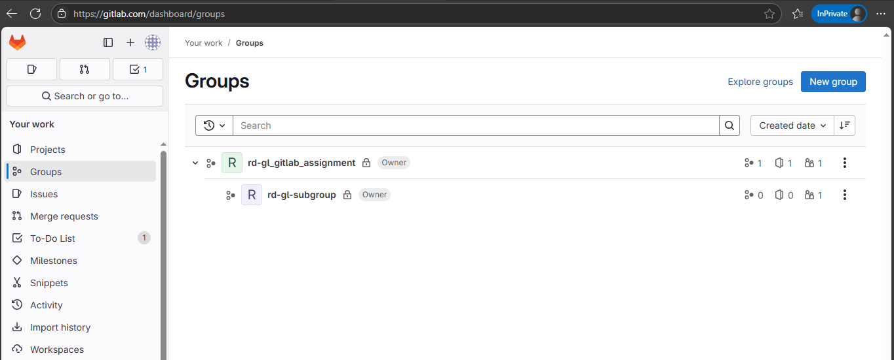

### 2. Create a subgroup  
Subgroups inherit settings and permissions from parent groups, enabling organization by team or function (e.g., backend/frontend).

📷 

### 3. Create projects  
Projects live under groups or subgroups and contain the actual Git repositories, CI/CD pipelines, and issue boards.

📷 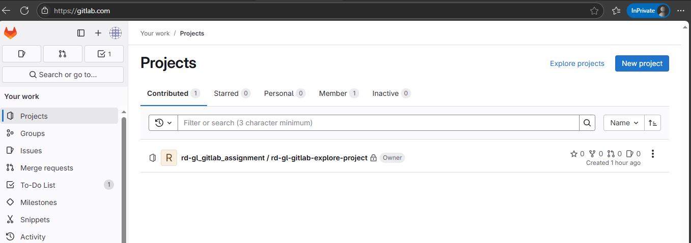

---

### 📋 Group Hierarchy Example

📷 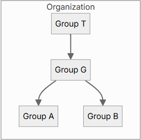

*(Source: GitLab Docs “Group hierarchy”) ([docs.gitlab.com](https://docs.gitlab.com/user/group/))*

---

## 👥 Permissions & Roles

GitLab roles are **distinct** — each role grants a specific set of permissions and **does not inherit from lower roles**.  
However, **access assigned at a higher level (like a group)** cascades down to all nested subgroups and projects.

| Role            | Scope       | Key Capabilities                      |
|-----------------|------------|----------------------------------------|
| **Guest**       | Group/Proj | View content, create/view issues, snippets |
| **Reporter**    | Group/Proj | Read code, view analytics, download artifacts |
| **Developer**   | Group/Proj | Push code, create MRs, run pipelines |
| **Maintainer**  | Group/Proj | Manage settings, members, pipelines |
| **Owner**       | Group only | Full control: delete, transfer groups/projects |

Reference: [GitLab Role Permissions](https://docs.gitlab.com/ee/user/permissions.html)

📷 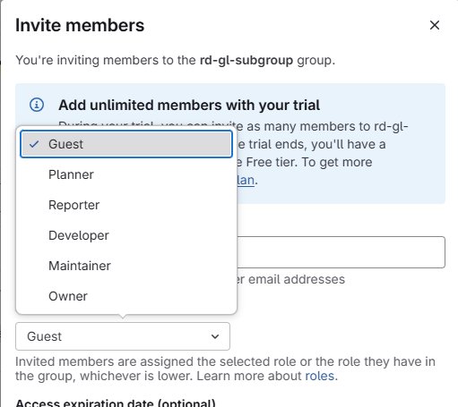

---

### 🔼 Highest Role Takes Precedence

If a user has multiple role assignments, **GitLab applies the highest role** in that context.

#### 🔍 Example:
- Group-level: **Reporter**
- Project-level: **Developer**
- ✅ The user gets **Developer** access for that project (more privileged)

This allows teams to grant elevated access to specific projects while maintaining stricter access across the rest of the group.


## 🔐 Understand Security Menu & Configuration Options

| Level             | Access Path                                | Visibility Scope                            | Dashboard Features                             | Limitations                                               |
|------------------|---------------------------------------------|---------------------------------------------|------------------------------------------------|-----------------------------------------------------------|
| **Top-Level Group** | `Group → Secure`                        | All projects and subgroups within the group | Security Center view, group-wide trends        | Cannot configure scanners; view-only dashboard            |
| **Subgroup**       | `Subgroup → Secure`                     | Projects directly under the subgroup         | Limited aggregated view (if enabled)           | May not show full security data unless explicitly added   |
| **Project**        | `Project → Secure`                         | Default branch of that single project        | Full scan results, vulnerability timeline      | Only shows recent scan results; limited to that project   |

---

## Security Menu at various levels

*Top Level Group*
📷 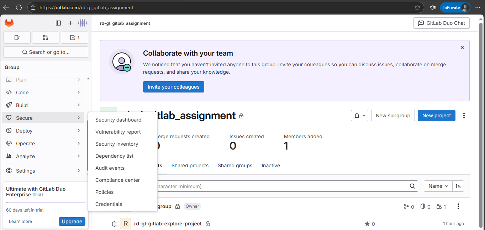

*Sub Group*
📷 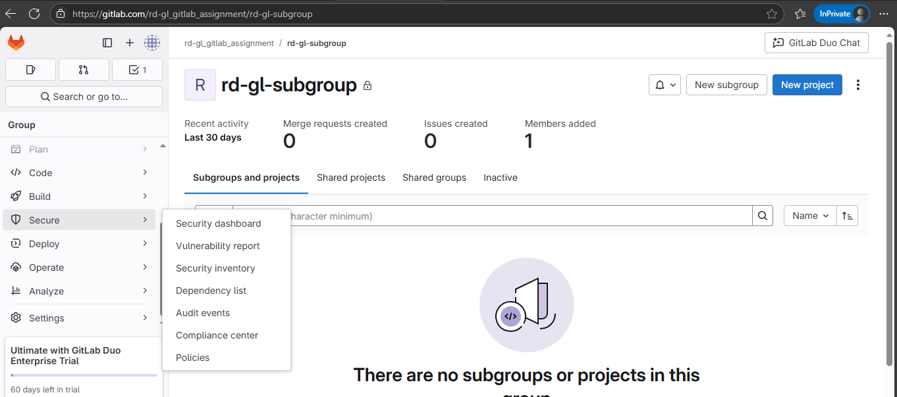

*Project*
📷 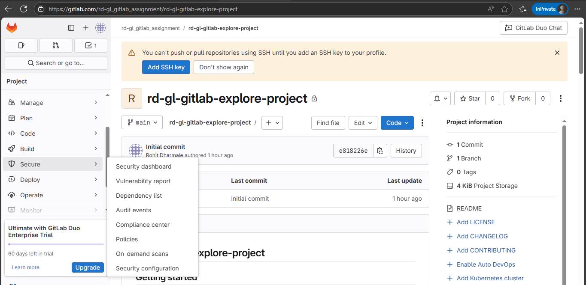

### ✅ Summary of Key Differences

- 🔹 **Project Level**:  
  - Full control to enable/disable security scanners like SAST, DAST, Secret Detection, etc.  
  - Access to detailed vulnerability list and fix suggestions.  
  - Security configuration available.

- 🔹 **Subgroup Level**:  
  - Aggregated security view only if explicitly configured.  
  - No scanner configuration; limited dashboard.

- 🔹 **Top-Level Group Level**:  
  - Visibility into all projects and nested subgroups.  
  - Offers high-level security grade summaries.  
  - No scanner configuration; serves as a monitoring layer.

---

### ⚠️ Limitations Summary

- Only the **project level** allows enabling/disabling specific scanners.
- **Group/Subgroup dashboards** are read-only views.
- **Subgroup visibility** depends on whether security is explicitly enabled for those projects.

# GitLab DevSecOps POCs

This section summarizes three Proof of Concepts (POCs) performed using GitLab’s built-in DevSecOps capabilities:  
1. **SAST Scanning**  
2. **Secret Detection**  
3. **Secret Push Protection**

Each POC includes purpose, benefits, configuration steps, and references to screenshots.

---

## 1. SAST Scanning (Static Application Security Testing)

**Description:**  
SAST scans source code for security vulnerabilities like SQL injection, XSS, command injection, etc., during CI/CD pipeline runs.

**Key Benefits:**
- Detects issues early in the development lifecycle.
- Supports multiple languages: Python, JavaScript, Java, etc.
- Integrated into GitLab Merge Requests, CI/CD, and Security Dashboard.

**How to Enable:**

1. Ensure your project has a `.gitlab-ci.yml` file.
2. Add the following snippet to the file:

    ```yaml
    include:
      - template: Security/SAST.gitlab-ci.yml
    ```

3. Commit and push the changes to your GitLab project.
4. The SAST job runs automatically in the pipeline.
5. View results in:
   - `Security → Vulnerability Report`

**Screenshot:**  
📷 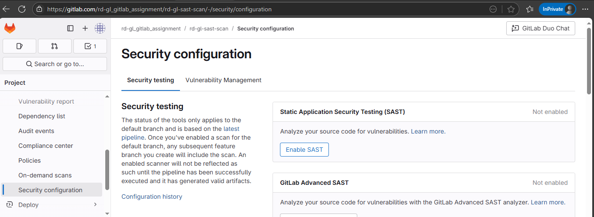
📷 

---

## 2. Secret Detection (CI-based)

**Description:**  
Secret Detection identifies hardcoded credentials like API keys, passwords, tokens, and sensitive strings in your repo during CI/CD pipeline runs.

**Key Benefits:**
- Scans source code and optionally Git history.
- Prevents leakage of credentials into production environments.
- Works on GitLab Free, Premium, and Ultimate tiers.
- Outputs results in the pipeline and GitLab security views.

**How to Enable:**

1. In your `.gitlab-ci.yml`, add the following line:

    ```yaml
    include:
      - template: Security/Secret-Detection.gitlab-ci.yml
    ```

2. To scan Git history as well (optional):

    ```yaml
    variables:
      SECRET_DETECTION_HISTORIC_SCAN: "true"
    ```

3. Commit and push the pipeline changes.
4. GitLab will automatically scan for secrets in modified files.

**Results shown in:**
- `Security → Vulnerability Report`

**Screenshot:** 

📷 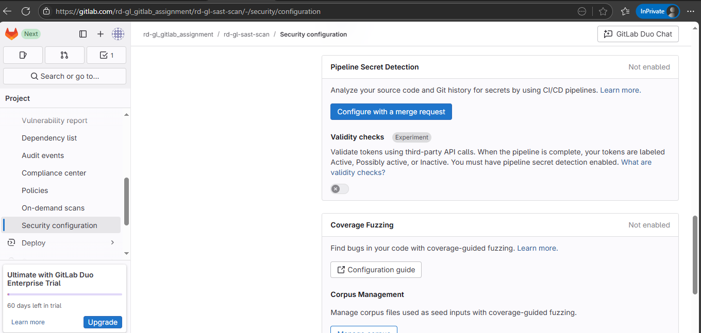
📷 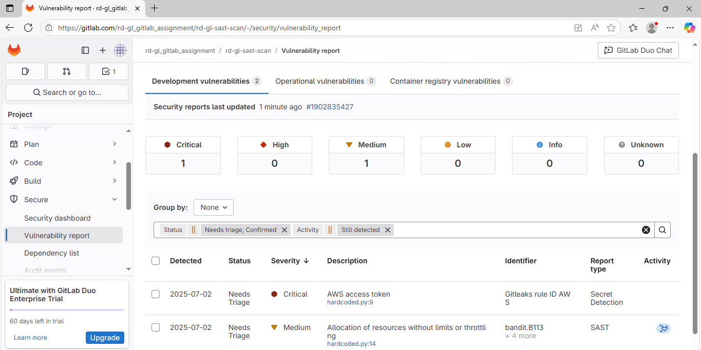

---

## 3. Secret Push Protection

**Description:**  
Block secrets such as keys and API tokens from being pushed to your repositories. Secret push protection is triggered when commits are pushed to a repository. If any secrets are detected, the push is blocked

**Key Benefits:**
- Prevents secrets before they enter your repository.
- Enforces secret blocking on push.

**How to Enable:**

📷 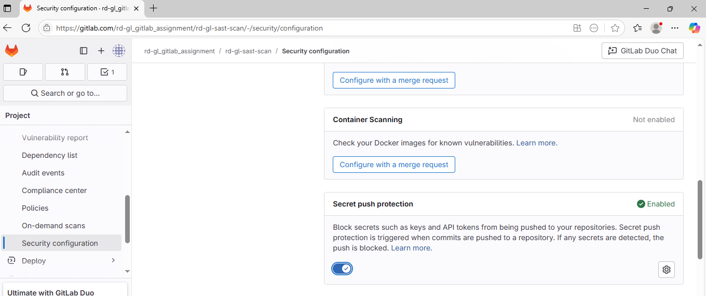

## Combined `.gitlab-ci.yml` Example

```yaml
# You can override the included template(s) by including variable overrides
# SAST customization: https://docs.gitlab.com/ee/user/application_security/sast/#customizing-the-sast-settings
# Secret Detection customization: https://docs.gitlab.com/user/application_security/secret_detection/pipeline/configure
# Dependency Scanning customization: https://docs.gitlab.com/ee/user/application_security/dependency_scanning/#customizing-the-dependency-scanning-settings
# Container Scanning customization: https://docs.gitlab.com/ee/user/application_security/container_scanning/#customizing-the-container-scanning-settings
# Note that environment variables can be set in several places
# See https://docs.gitlab.com/ee/ci/variables/#cicd-variable-precedence
include:
- template: Security/SAST.gitlab-ci.yml
- template: Security/Secret-Detection.gitlab-ci.yml
stages:
- test
- secret-detection
sast:
  stage: test
secret_detection:
  stage: secret-detection


