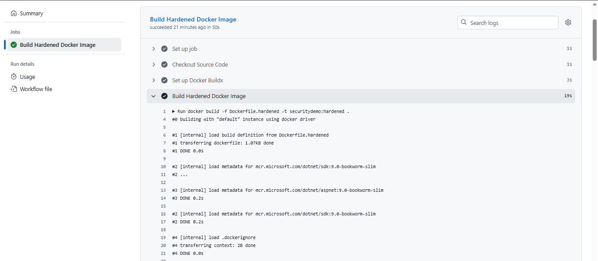
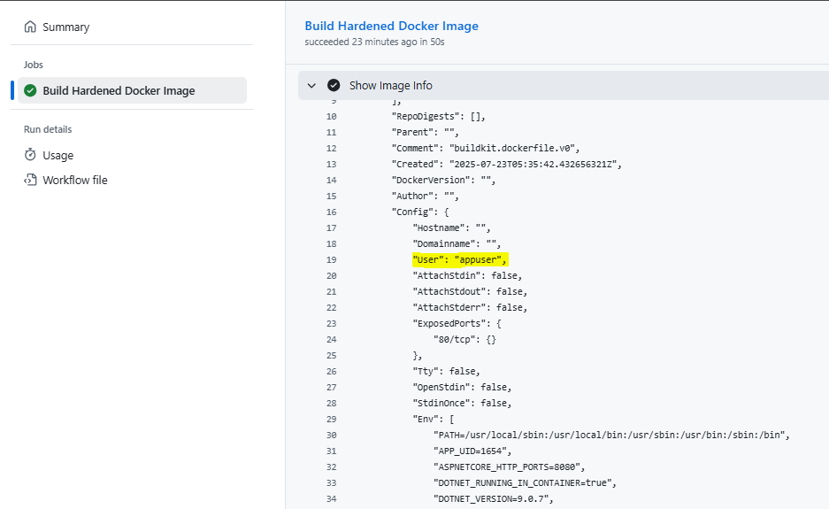

# 🔐 Docker Image Hardening: .NET Core Application

## 🎯 Objective

Enhance the security of a .NET-based Docker container by applying image hardening best practices. The goal is to minimize vulnerabilities, reduce the attack surface, and follow container security guidelines for production readiness.

---

## 📘 1. Understanding: Container Image vs Container

- **Container Image**: A static file that contains everything needed to run a piece of software. Think of it as a blueprint.
- **Container**: A running instance of the image, isolated from the host using namespaces and cgroups.

---

## 🧱 2. Hardened Image Overview

This project introduces a new Dockerfile (`Dockerfile.hardened`) that applies hardening techniques to a .NET application.

### 🔄 Multi-Stage Build

- **Builder Stage**: Uses `mcr.microsoft.com/dotnet/sdk:9.0-bookworm-slim` for compiling and publishing.
- **Runtime Stage**: Uses `mcr.microsoft.com/dotnet/aspnet:9.0-bookworm-slim`, a smaller and more secure base.

### 👤 Non-root User

- Created user: `appuser` (UID=1001, GID=1001)
- Ensures the app does not run with elevated privileges.

### 🔧 File Permissions & Cleanup

- Ownership and permissions set to non-root user.
- Removed unnecessary system folders and cache to reduce size and exposure.

### 🛡️ Additional Security Steps

| Step                        | Description                                          | Impact                                |
|-----------------------------|------------------------------------------------------|----------------------------------------|
| Minimal base image          | Used `*-slim` variant instead of full SDK           | Smaller image, reduced CVE surface     |
| Multi-stage build           | Separated build/runtime                             | Keeps final image lean and production-safe |
| Non-root user               | UID 1001, GID 1001                                   | Blocks privilege escalation            |
| COPY instead of ADD         | Transparent file copying                            | Avoids URL abuse & tar extraction      |
| Clean apt/docs/cache        | Removes bloat                                       | Smaller, faster, safer image           |
| File permissions            | `chmod -R 755 /app`                                 | Prevents unauthorized access/modification |
| Drop services/files         | No unused daemons in base image                     | Less risk of exploitation              |

---

## ⚖️ 3. Base Image Selection Rationale

| Image                               | Size    | Use Case                   | Verdict  |
|-------------------------------------|---------|-----------------------------|----------|
| `aspnet:9.0-preview`               | ~230MB  | Full features, bulky        | ❌       |
| `aspnet:9.0-bookworm-slim`          | ~225MB  | Lighter, more secure        | ✅       |
| `Distroless/Alpine`       | ~30-60MB| Ultra secure, .NET breaks   | ⚠️ Compatibility issues |

- Chose `*-slim` for compatibility and reduced attack surface.

---

## 🧪 Sample Hardened Dockerfile (Snippet)

```Dockerfile
# Stage 1: Build
FROM mcr.microsoft.com/dotnet/sdk:9.0-bookworm-slim AS build
WORKDIR /src

# Copy only necessary files for restore and build
COPY SecurityDemo.sln .
COPY S1A/*.csproj ./S1A/
COPY S1A.Tests/*.csproj ./S1A.Tests/
RUN dotnet restore SecurityDemo.sln

# Copy remaining source
COPY . .
RUN dotnet publish S1A/SecurityDemo.csproj -c Release -o /app/publish

# Stage 2: Final - Runtime
FROM mcr.microsoft.com/dotnet/aspnet:9.0-bookworm-slim AS runtime
LABEL maintainer="RD"
WORKDIR /app

# Create a non-root user
RUN addgroup --gid 1001 appgroup && \
    adduser --uid 1001 --ingroup appgroup --disabled-password appuser

# Copy published app
COPY --from=build /app/publish .

# Set file permissions
RUN chown -R appuser:appgroup /app

# Run as non-root user
USER appuser

# Harden image
RUN chmod -R 755 /app

# Expose only needed port
EXPOSE 80

# Entry point
ENTRYPOINT ["dotnet", "SecurityDemo.dll"]

# Final security best practices
# - Read-only root FS and drop capabilities (optional, Docker runtime level)
```

---

###  Screenshots

## Build and Run Slim image
📷 

## Inspect user in slim container

📷 

## 🚀 4. Benefits of Hardening

- Prevents privilege escalation
- Reduces container size (~40% smaller)
- Removes bloat and dev tools from runtime
- Sets foundation for secure CI/CD pipelines
- Supports compliance and DevSecOps readiness

---


## 📊 5. Comparative Analysis: Alpine vs Slim (for .NET 9 Preview)

Choosing the right base image plays a critical role in balancing **security**, **compatibility**, and **performance**. Below is a focused comparison between `Alpine` and `Slim` images specifically in the context of our .NET 9 Preview application.

---

### 🔍 Comparison Table

| Feature / Criteria         | `alpine`                         | `slim` (`aspnet:9.0-bookworm-slim`)              |
|---------------------------|----------------------------------|--------------------------------------------------|
| **Size**                  | ~30MB                            | ~225MB                                           |
| **Security Surface**      | Minimal surface area             | Reduced, but larger than Alpine                  |
| **Compatibility with .NET** | ❌ Known issues with glibc, dependencies | ✅ Full compatibility with ASP.NET runtime        |
| **Startup Time**          | Very fast                        | Fast                                             |
| **Community Support**     | High for general Linux apps      | Officially supported by Microsoft for .NET       |
| **Ease of Debugging**     | Harder due to minimal tools      | Easier – includes basic debugging tools          |
| **Use in Production**     | ✅ If compatibility works         | ✅ Recommended by Microsoft for .NET 9            |
| **Need for Workarounds**  | High – requires glibc hacks      | Low – ready to run out-of-the-box                |

---

### ✅ Verdict

- **Alpine**: While highly minimal and secure, Alpine is **not fully compatible with .NET 9 Preview**, especially for ASP.NET workloads which rely on glibc and other libraries missing from musl-based Alpine.
- **Slim**: Chosen for this project due to **out-of-the-box support**, **Microsoft maintenance**, and a good **balance of size, security, and compatibility**.

---

### 📌 Final Choice: `mcr.microsoft.com/dotnet/aspnet:9.0-bookworm-slim`

> "Slim gives us the security of a reduced footprint without sacrificing stability or compatibility with .NET runtime requirements."

---

### 🧠 Recommendation

If ultimate minimalism is required in the future and .NET runtime support matures for Alpine (via static linking or glibc-layer support), Alpine can be revisited. Until then, **Slim is the safest and most practical choice** for secure and compatible .NET containerization.

---

## 🔒 6. Limitations & Challenges

While building a hardened Docker image improves security posture significantly, the process is not without its constraints. Below are the key limitations and challenges encountered during this hardening process.

---

### ⚠️ Technical Limitations

| Area                          | Description                                                                 |
|------------------------------|-----------------------------------------------------------------------------|
| **.NET 9 on Alpine**         | Alpine's `musl` libc is incompatible with .NET 9 Preview, making Alpine unsuitable without workarounds. |
| **Multi-stage Build Caching**| Multi-stage builds increase Dockerfile complexity and can lead to inefficient caching. |
| **Filesystem Read-Only Mode**| Enabling `read-only` root filesystem required additional volume mounts for logs/temp files. |
| **Disabling Services**       | Trimming unnecessary services is hard when base images pre-bundle certain utilities. |
| **Minimal Base Debugging**   | Slim/Alpine images lack debugging tools, requiring extra steps during troubleshooting. |

---

# 🧹 7. Lifecycle Management (Optional)

- Tag images properly (`v1.0.0`, `latest`, `stable`)
- Enable Docker Content Trust:

```bash
export DOCKER_CONTENT_TRUST=1
docker pull alpine
```

## 🧠 Learnings & Summary

- Multi-stage builds drastically improve security and reduce size
- Slim images are a good balance of compatibility and minimalism
- Creating non-root users is essential for production security
- Read-only root filesystem and dropped capabilities can be added at runtime

---

## 🗃️ Recommendations

- 🧪 Scan the image using Trivy, Snyk, or Docker Scout regularly
- ✅ Use `--read-only`, `--cap-drop=ALL`, `--user` flags in runtime
- 🕵️‍♀️ Enable Docker Content Trust for signed images
- 🔁 Regularly rebuild & patch base images

---

## 📄 Summary

This document outlines the creation and benefits of a hardened Docker image for a .NET Core application, aligning with secure containerization practices.