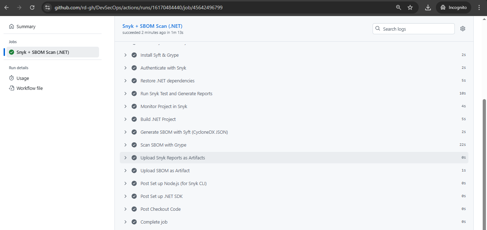
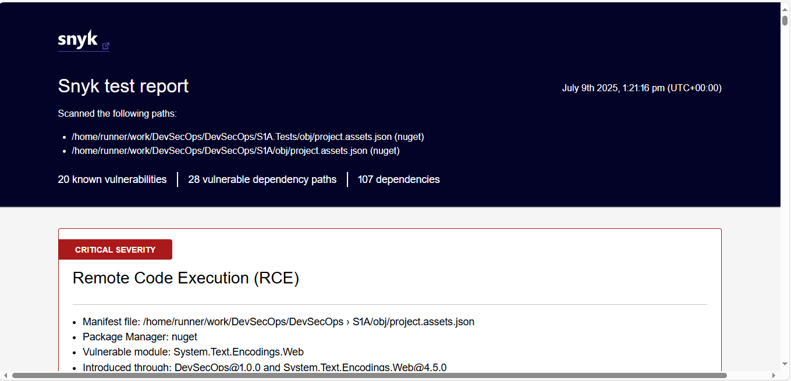
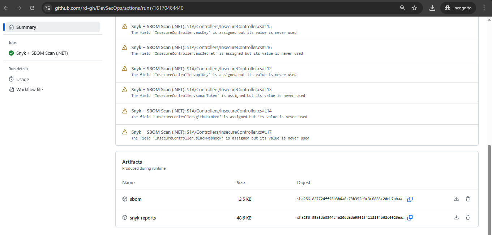
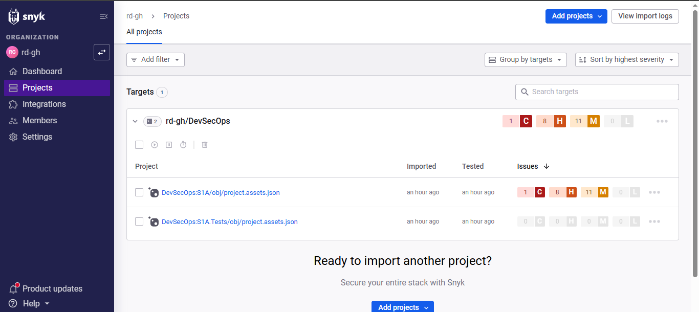
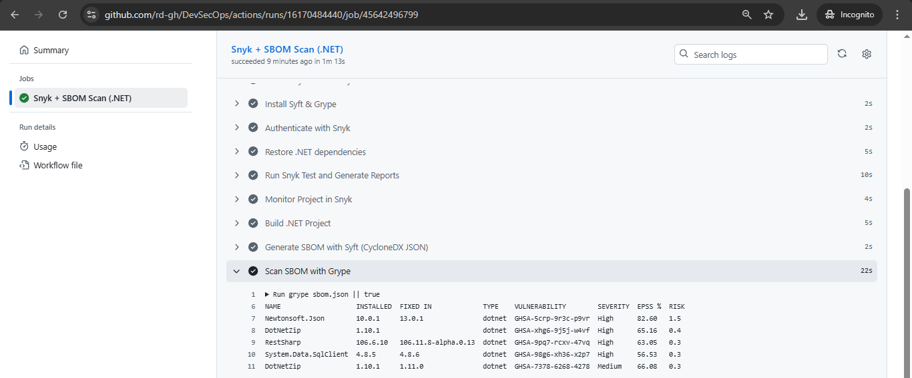

# 🔍 Software Composition Analysis (SCA) for .NET Core with Snyk + SBOM (GitHub Actions)

## 1. Context: Why We Are Doing This

Modern .NET applications rely heavily on third-party NuGet packages. Software Composition Analysis (SCA) ensures early identification of known vulnerabilities in both direct and transitive dependencies. Integrating this into CI/CD helps enforce secure-by-default principles.

This setup:
- Detects known CVEs in dependencies
- Provides machine-readable + human-readable reports
- Generates SBOMs for compliance and traceability
- Uses GitHub Actions for automation and reproducibility

---

## 2. Tool Selection & Justification

✅ **Selected Tools:**
- **Snyk** for SCA (JSON + HTML reports)
- **Syft** for SBOM generation (CycloneDX JSON)
- **Grype** for scanning SBOM against known CVEs

| Tool            | Reasoning                                              |
|----------------|--------------------------------------------------------|
| Snyk           | Fast, free for small projects, GitHub integration ✅   |
| Syft           | Generates CycloneDX SBOM, easy to use in CI ✅         |
| Grype          | Lightweight vulnerability scanner for SBOMs ✅         |

**CI Tool Used:** GitHub Actions  
**Project:** [.NET Core `SecurityDemo.sln` with `S1A` and `S1A.Tests` projects]

---

## 3. GitHub Actions Workflow (Snyk + SBOM Integration)

### 🛠️ Trigger Conditions
- On push to `main`
- On pull request to `main`

### 🔧 Workflow Summary

```yaml
# Full GitHub Actions YAML pipeline for Snyk + Syft + Grype
name: SCA with Snyk + SBOM for .NET Core

on:
  workflow_dispatch:
  push:
    branches: [main]
  pull_request:
    branches: [main]

jobs:
  snyk-sca-sbom:
    name: Snyk + SBOM Scan (.NET)
    runs-on: ubuntu-latest
    continue-on-error: true

    steps:
      - name: Checkout Code
        uses: actions/checkout@v4

      - name: Set up .NET SDK
        uses: actions/setup-dotnet@v4
        with:
          dotnet-version: '9.0.x'

      - name: Set up Node.js (for Snyk CLI)
        uses: actions/setup-node@v4
        with:
          node-version: '20'

      - name: Install Snyk CLI and snyk-to-html
        run: |
          npm install -g snyk snyk-to-html

      - name: Install Syft & Grype
        run: |
          curl -sSfL https://raw.githubusercontent.com/anchore/syft/main/install.sh | sh -s -- -b /usr/local/bin
          curl -sSfL https://raw.githubusercontent.com/anchore/grype/main/install.sh | sh -s -- -b /usr/local/bin
          syft version && grype version

      - name: Authenticate with Snyk
        env:
          SNYK_TOKEN: ${{ secrets.SNYK_TOKEN }}
        run: snyk auth $SNYK_TOKEN

      - name: Restore .NET dependencies
        run: dotnet restore

      - name: Run Snyk Test and Generate Reports
        env:
          SNYK_TOKEN: ${{ secrets.SNYK_TOKEN }}
        run: |
          mkdir -p snyk-reports
          snyk test --all-projects --json-file-output=snyk-reports/snyk-report.json || true
          snyk test --all-projects --json | snyk-to-html -o snyk-reports/snyk-report.html || true

      - name: Monitor Project in Snyk
        env:
          SNYK_TOKEN: ${{ secrets.SNYK_TOKEN }}
        run: snyk monitor --all-projects || true

      - name: Build .NET Project
        run: dotnet build SecurityDemo.sln --configuration Release

      - name: Generate SBOM with Syft (CycloneDX JSON)
        run: |
          mkdir merged-build
          cp -r S1A/bin/Release/net9.0/* merged-build/ || true
          cp -r S1A.Tests/bin/Release/net9.0/* merged-build/ || true
          syft dir:merged-build -o cyclonedx-json > sbom.json

      - name: Scan SBOM with Grype
        run: grype sbom.json || true

      - name: Upload Snyk Reports as Artifacts
        uses: actions/upload-artifact@v4
        with:
          name: snyk-reports
          path: snyk-reports/

      - name: Upload SBOM as Artifact
        uses: actions/upload-artifact@v4
        with:
          name: sbom
          path: sbom.json
```
## A: Successful GitHub Actions Run (All Steps Visible)



## B: HTML Report Rendered View



## C: Uploaded Artifacts Section in GitHub Actions



## D: Synk Monitoring Enabled



## E: Grype Scan Findings



---

## 4. Vulnerability Summary

## 🔐 Vulnerability Summary (Snyk Report)

| Severity  | Count |
|-----------|-------|
| 🔴 Critical | 1     |
| 🟠 High     | 16    |
| 🟡 Medium   | 11    |
| 🔵 Low      | 0     |
| **Total**  | **28** |

> This report includes direct and transitive dependencies detected via `snyk test`.
> Includes CVE ID, description, affected version, and remediation guidance.

---

## 5. Recommended Mitigations

- Apply package upgrades as recommended by the Snyk report.
- Swap out unpatched libraries with actively maintained alternatives.
- Automate recurring scans and enable Snyk checks on pull requests for continuous protection.

📌 **Example**:

```json
          {
            "type": "secondary",
            "vector": "CVSS:3.1/AV:N/AC:L/PR:N/UI:N/S:U/C:H/I:N/A:N",
            "assigner": "Red Hat",
            "severity": "high",
            "baseScore": 7.5,
            "cvssVersion": "3.1",
            "modificationTime": "2024-03-11T09:48:57.544126Z"
          }
        ],
        "description": "## Overview\n\nAffected versions of this package are vulnerable to Unprotected Storage of Credentials. An attacker can steal authentication credentials intended for the database server by performing an adversary-in-the-middle attack between the SQL client and the SQL server, even if the connection is established over an encrypted channel like TLS.\n## Remediation\nUpgrade `System.Data.SqlClient` to version 4.8.6 or higher.\n## References\n- [GitHub Commit](https://github.com/dotnet/SqlClient/commit/4deb800c9534992d80573bcdb39439bece4ce0d5)\n- [RedHat Bugzilla Bug](https://bugzilla.redhat.com/show_bug.cgi?id=2255384)\n- [Release Notes](https://github.com/dotnet/SqlClient/blob/2e4d1b69793e7ca3d7d9f2bc85206b933808ef3c/release-notes/2.1/2.1.7.md?plain=1#L9)\n- [Release Notes](https://github.com/dotnet/SqlClient/blob/2e4d1b69793e7ca3d7d9f2bc85206b933808ef3c/release-notes/3.1/3.1.5.md?plain=1#L9)\n- [Release Notes](https://github.com/dotnet/SqlClient/blob/2e4d1b69793e7ca3d7d9f2bc85206b933808ef3c/release-notes/4.0/4.0.5.md?plain=1#L9)\n- [Release Notes](https://github.com/dotnet/SqlClient/blob/2e4d1b69793e7ca3d7d9f2bc85206b933808ef3c/release-notes/5.1/5.1.3.md?plain=1#L9)\n",
        "epssDetails": {
          "percentile": "0.56499",
          "probability": "0.00346",
          "modelVersion": "v2025.03.14"
        },
        "identifiers": {
          "CVE": [
            "CVE-2024-0056"
          ],
          "CWE": [
            "CWE-420"
          ]
        },
        "packageName": "System.Data.SqlClient",
        "proprietary": false,
        "creationTime": "2024-01-10T11:07:16.686561Z",
        "functions_new": [],
        "alternativeIds": [],
        "disclosureTime": "2024-01-09T00:00:00Z",
        "exploitDetails": {
          "sources": [],
          "maturityLevels": [
            {
              "type": "secondary",
              "level": "Not Defined",
              "format": "CVSSv3"
            },
            {
              "type": "primary",
              "level": "Not Defined",
              "format": "CVSSv4"
            }
          ]
        },
        "packageManager": "nuget",
        "publicationTime": "2024-01-10T12:57:04.830720Z",
        "severityBasedOn": "CVSS",
        "modificationTime": "2024-03-11T09:48:57.544126Z",
        "socialTrendAlert": false,
        "severityWithCritical": "high",
        "from": [
          "DevSecOps@1.0.0",
          "System.Data.SqlClient@4.8.5"
        ],
        "upgradePath": [
          false,
          "System.Data.SqlClient@4.8.6"
        ],
        "isUpgradable": true,
        "isPatchable": false,
        "name": "System.Data.SqlClient",
        "version": "4.8.5"
      }
```
---

## 6. Benefits & Impact

### ✅ **Benefits:**
- Snyk finds real-world CVEs in .NET packages
- Reports are actionable (HTML for humans, JSON for automation)
- SBOM aligns with NIST/NIS2/SBOM compliance
- SBOM + Grype enables defense-in-depth
- Continue-on-error ensures CI visibility without blocking merges

---

### 🧠 Challenges & Solutions

| Challenge                         | Solution                                             |
|----------------------------------|------------------------------------------------------|
| .NET 8/9 version mismatch         | Aligned all projects to `net9.0`                     |
| Syft can’t scan `.sln` files      | Used `dir:` to scan compiled `bin/Release` outputs   |
| `snyk monitor` flag error         | Removed `--file` when using `--all-projects`         |
| Syft cannot scan multiple dirs   | Merged outputs to temp dir before SBOM generation    |

---

## 7. Files & Artifacts

| File / Artifact         | Description                                    |
|-------------------------|------------------------------------------------|
| `snyk-report.json`      | Raw machine-readable scan result              |
| `snyk-report.html`      | Formatted HTML report                         |
| `sbom.json`             | CycloneDX SBOM from compiled project          |
| `.github/workflows/sca-snyk.yml`               | GitHub Actions workflow                       |
| `sca-synk-sbom.md`          | Detailed techinal documentation of configuration                       |

---

## 8. Conclusion

This GitHub-based SCA pipeline using **Snyk**, **Syft**, and **Grype** gives .NET developers:

- Complete visibility into dependency risks
- Compliance-ready SBOM generation
- Early detection of vulnerabilities
- Resilience without blocking CI/CD

🎯 We now have a lightweight, effective, and auditable DevSecOps setup ready to scale.
