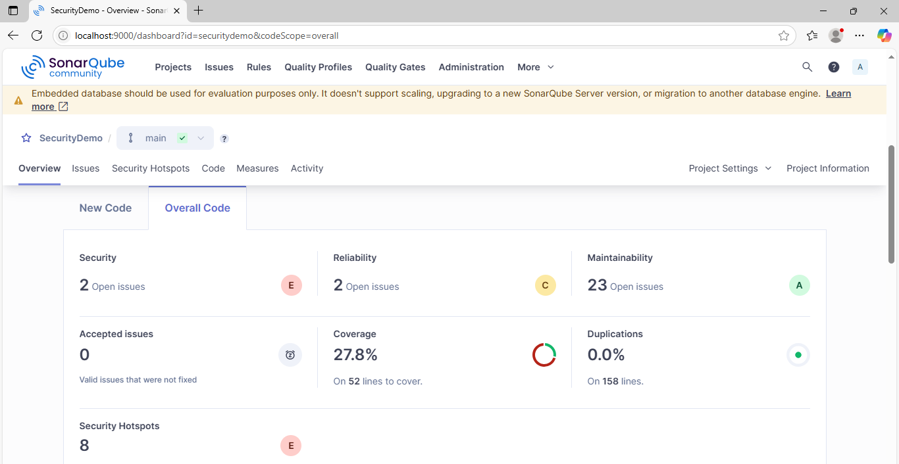
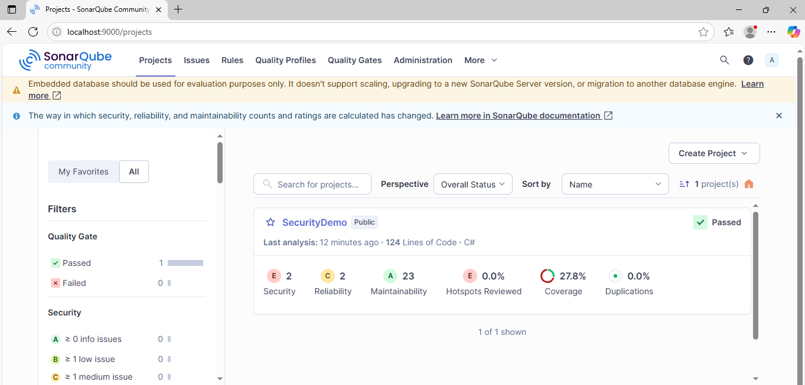
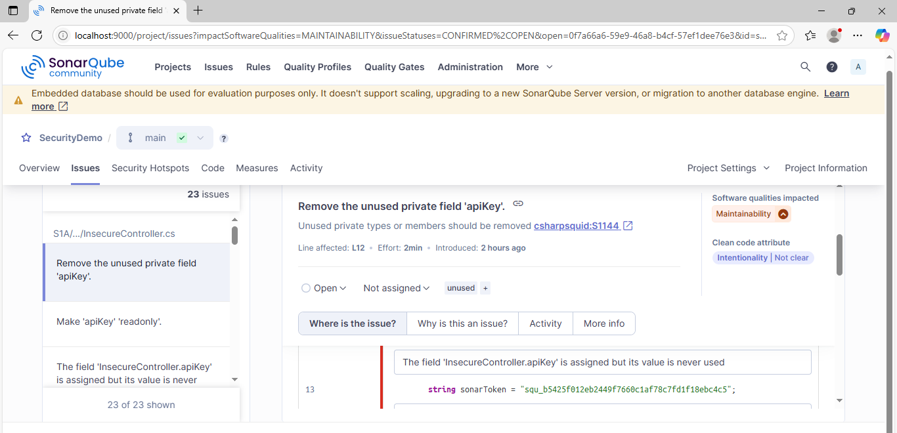
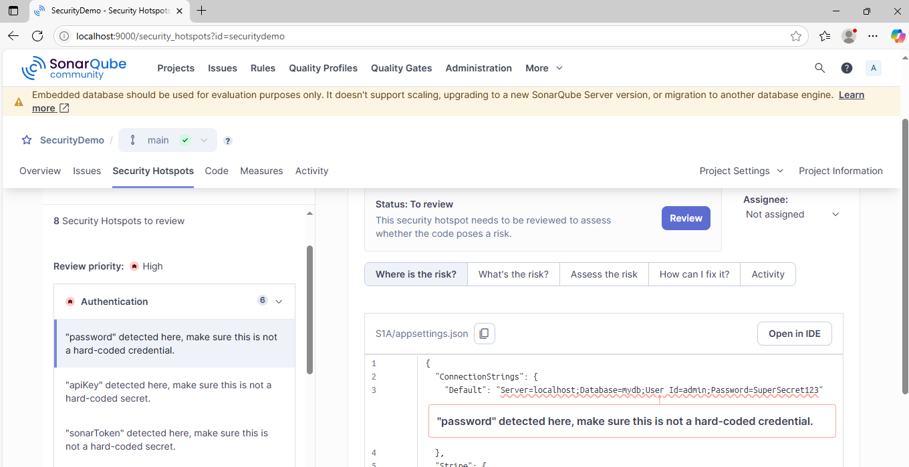
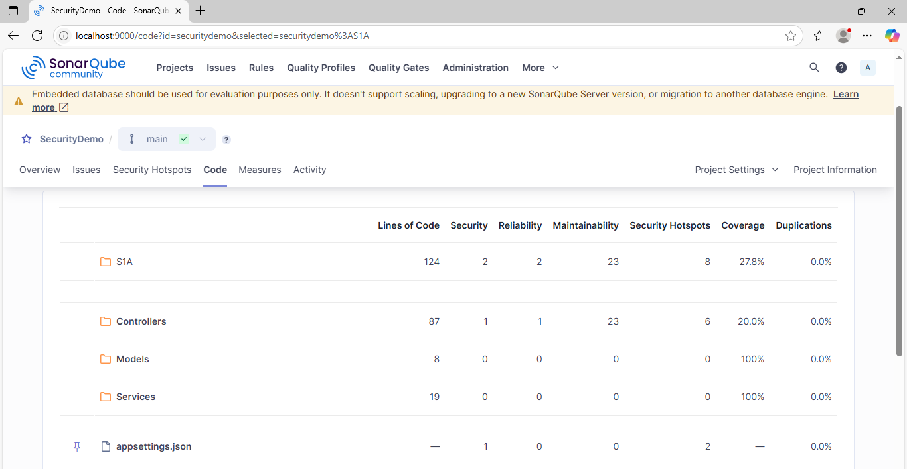

# SonarQube Static Code Analysis Integration

## Introduction

SonarQube is a Static Application Security Testing (SAST) tool that helps detect bugs, vulnerabilities, code smells, and security hotspots in codebases. It integrates seamlessly into development pipelines and enforces code quality and security standards during CI/CD. This report documents the integration and findings for the `.NET Core` project named **SecurityDemo**.

---

## Project Overview

| Key                | Value                          |
|--------------------|--------------------------------|
| Project Name       | SecurityDemo                   |
| Project Key        | securitydemo                   |
| SonarQube Host     | http://localhost:9000          |
| Source Directory   | S1A/                           |
| Test Project       | S1A.Tests/S1A.Tests.csproj     |
| Test Framework     | xUnit                          |
| Coverage Tool      | Coverlet                       |
| Report Format      | Cobertura XML                  |
| Workflow           | Manual & GitHub Actions        |

---

## Integration Steps

### 1. Host SonarQube Locally

SonarQube was hosted locally using Docker Desktop on port `9000`.

```sh
docker pull sonarqube
docker run --name sonarqube-custom -p 9000:9000 sonarqube
```

### 2. Configure Code Coverage

Installed `coverlet.collector` in the test project:

```xml
<PackageReference Include="coverlet.collector" Version="6.0.4" />
```

### 3. Install Tools

Install the SonarScanner CLI:

```sh
dotnet tool install --global dotnet-sonarscanner
```

### 4. Run Code Coverage Tests

```sh
dotnet test S1A.Tests/S1A.Tests.csproj --collect:"XPlat Code Coverage"
```

Ensure the output XML file (`coverage.cobertura.xml`) is generated inside `TestResults/{guid}/`.

### 5. Start SonarQube Analysis

```sh
dotnet sonarscanner begin `
  /k:"securitydemo" `
  /n:"SecurityDemo" `
  /v:"1.0" `
  /d:sonar.host.url="http://localhost:9000" `
  /d:sonar.login="<YOUR_TOKEN>" `
  /d:sonar.cs.opencover.reportsPaths="TestResults/**/coverage.cobertura.xml" `
  /d:sonar.sources="S1A"
```

### 6. Build the Project

```sh
dotnet build S1A/SecurityDemo.csproj --no-incremental
```

### 7. End the Analysis

```sh
dotnet sonarscanner end /d:sonar.login="<YOUR_TOKEN>"
```

---

## GitHub Actions Workflow (Optional for Public SonarQube)

If using a public SonarQube instance, create a GitHub Actions workflow in `.github/workflows/sonar.yml`. Please check out the already created workflow.

---

## Scan Summary

Checkout the complete Scan summary report at [sonar-scan-report.md](https://github.com/rd-gh/DevSecOps/blob/main/sonar-scan-report.md)

---

## Scans/Findings Evidences

1. 📷 
2. 📷 
3. 📷 
4. 📷 
5. 📷 

---

## Exporting Reports

You can extract results using the SonarQube Web API:

### Example:

```bash
curl -u <token>: "http://localhost:9000/api/measures/component?component=securitydemo&metricKeys=bugs,vulnerabilities,code_smells,coverage"
```

Or to fetch hotspots:

```bash
curl -u <token>: "http://localhost:9000/api/hotspots/search?projectKey=securitydemo"
```

---

## Conclusion

The SonarQube scan for the POC project successfully identified key issues in the codebase. The tool is now integrated into the local environment and optionally with GitHub Actions for CI/CD automation. Future commits and pull requests will benefit from continuous static analysis for improved code quality and security.