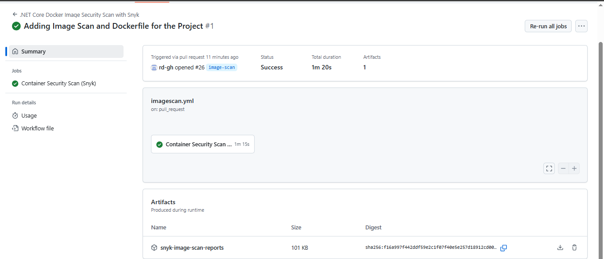
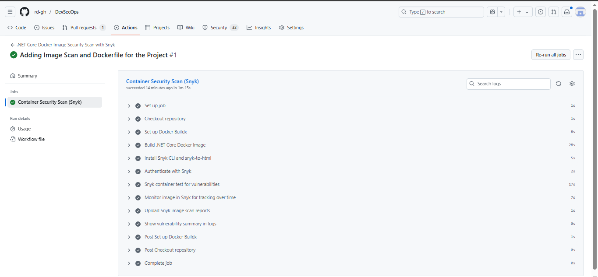
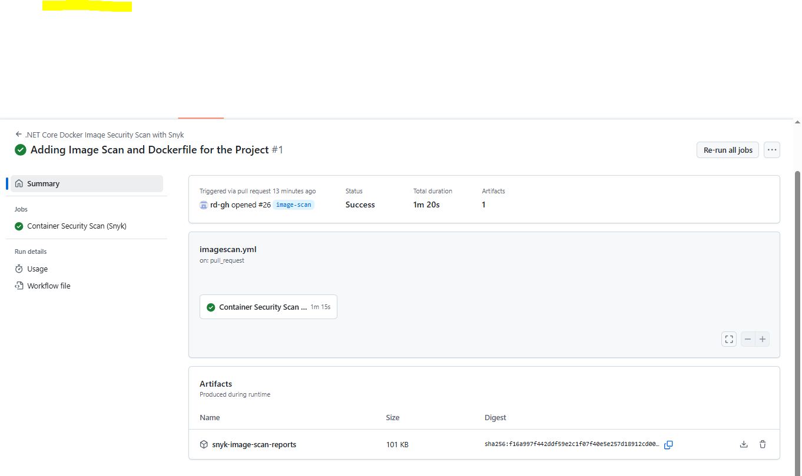
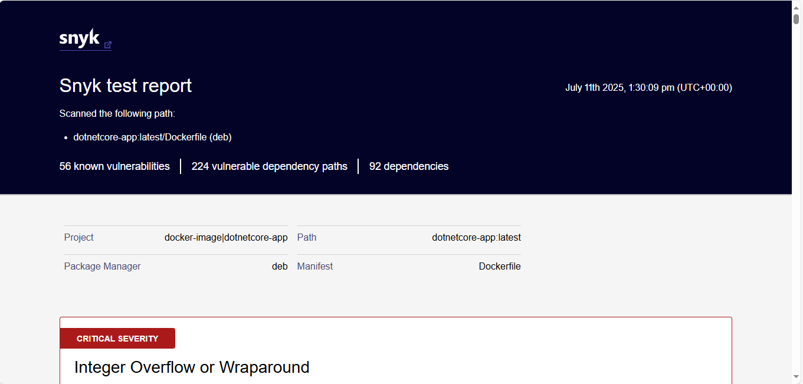
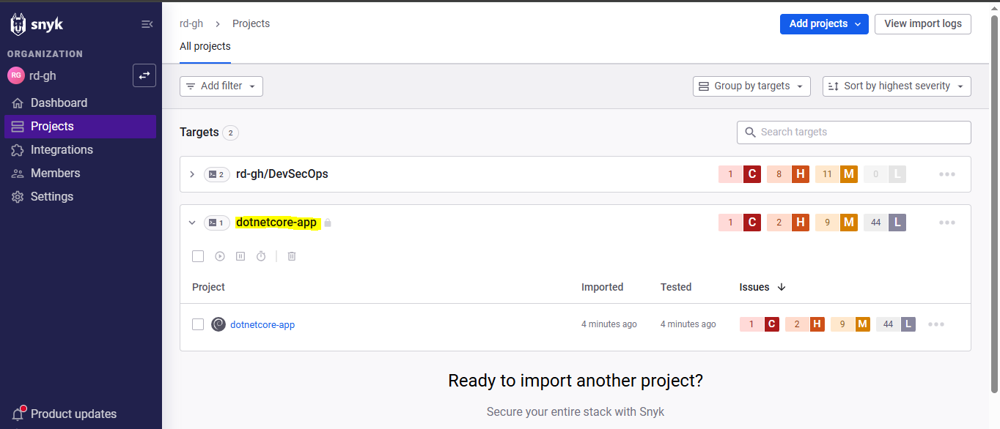

# 🔐 Docker Image Scanning for .NET Core — Technical Documentation

## 1. 📘 Background: Why Image Scanning Matters

With containerized .NET applications, the Docker image is as critical as your source code. Vulnerabilities in base layers or runtime packages can introduce attack vectors if not scanned proactively.

This setup demonstrates how we:

- Build `.NET 9` Docker image from source
- Scan the image for known CVEs using **Snyk**
- Generate JSON + HTML reports
- Upload the scan artifacts
- Monitor image for ongoing vulnerability changes via `snyk monitor`
- Integrate it all within GitHub Actions

---

## 2. ⚙️ Tool Selection Rationale

✅ **Chosen Tool:** Snyk (Free Community Tier)

| Tool         | Status | Reason |
|--------------|--------|--------|
| **Snyk**     | ✅ Selected | GitHub-native, supports HTML/JSON, supports `monitor`, easy to automate |
| Trivy        | ❌ Skipped | Great for CLI, but report export flexibility is limited |
| Grype        | ❌ Skipped | No built-in HTML reporting without extra setup |
| Docker Scout | ❌ Skipped | Early-stage tool, not yet enterprise-ready for report customization |

**CI Used:** GitHub Actions  
**Dockerfile Location:** Project root (`/`)  
**Image Tag:** `dotnetcore-app:latest`

---

## 3. 🚀 GitHub Actions Workflow: Docker Image Scanning

### 🔁 Trigger Conditions

- `push` to `main`
- `pull_request` to `main`
- Manual `workflow_dispatch`

### 📄 Pipeline: `imagescan.yml`

```yaml
name: .NET Core Docker Image Security Scan with Snyk

on:
  workflow_dispatch:
  push:
    branches: [main]
  pull_request:
    branches: [main]

jobs:
  container-security-scan:
    name: Container Security Scan (Snyk)
    runs-on: ubuntu-latest
    permissions:
      contents: read

    steps:
      - name: Checkout repository
        uses: actions/checkout@v3

      - name: Set up Docker Buildx
        uses: docker/setup-buildx-action@v2

      - name: Build .NET Core Docker Image
        run: |
          docker build -t dotnetcore-app:latest .

      - name: Install Snyk CLI and snyk-to-html
        run: npm install -g snyk snyk-to-html

      - name: Authenticate with Snyk
        run: snyk auth ${{ secrets.SNYK_TOKEN }}

      - name: Snyk container test for vulnerabilities
        run: |
          snyk container test dotnetcore-app:latest --file=Dockerfile --json > snyk-image-report.json || true
          snyk container test dotnetcore-app:latest --file=Dockerfile --json | snyk-to-html -o snyk-image-report.html || true
        env:
          SNYK_TOKEN: ${{ secrets.SNYK_TOKEN }}

      - name: Monitor image in Snyk for tracking over time
        run: snyk container monitor dotnetcore-app:latest --file=Dockerfile
        env:
          SNYK_TOKEN: ${{ secrets.SNYK_TOKEN }}

      - name: Upload Snyk image scan reports
        uses: actions/upload-artifact@v4
        with:
          name: snyk-image-scan-reports
          path: |
            snyk-image-report.json
            snyk-image-report.html

      - name: Show vulnerability summary in logs
        run: |
          echo "=== Snyk Image Vulnerability Summary ==="
          if [ -s snyk-image-report.json ]; then
            jq -r '.vulnerabilities[] | "\(.severity | ascii_upcase): \(.title) (\(.packageName)@\(.version))"' snyk-image-report.json
          else
            echo "No vulnerabilities found or scan failed."
          fi
```

---

## 4. 🧾 Outputs & Visuals

### ✅ GitHub ImageScan Actions Workflow Execution




### 📁 Snyk Image Scan Artifacts Upload



### 🌐 Snyk Image Scan HTML Report



### 📊 Snyk Dashboard View



---

## 5. 🧨 Vulnerability Summary Snapshot

| Severity | Approximate Count |
|----------|-------------------|
| Critical | 1                |
| High     | 2               |
| Medium   | 9               |
| Low      | 44               |
| **Total**| **56**           |

Key insights:
- Lists packages, versions, CVEs, and suggested fixes
- Tracks vulnerability origin (image layer, dependency, etc.)
- HTML report enables security reviews by non-developers

---

## 6. ✅ Recommendations & Mitigation Steps

- Switch to secure base images (e.g., `mcr.microsoft.com/dotnet/aspnet:9.0` → `aspnet:9.0-preview`)
- Avoid unpinned or legacy packages like `curl`, `libssl1.1`, etc.
- Schedule periodic Snyk re-scans (daily/weekly)
- Consider blocking PRs on new critical vulnerabilities

📍 Example Finding:

```json
      "from": [
        "docker-image|dotnetcore-app@latest",
        "shadow/login@1:4.13+dfsg1-1+b1"
      ],
      "upgradePath": [
        false,
        "shadow/login@1:4.13+dfsg1-1+deb12u1"
      ],
      "isUpgradable": true,
      "isPatchable": false,
      "name": "shadow/login",
      "version": "1:4.13+dfsg1-1+b1",
      "nearestFixedInVersion": "1:4.13+dfsg1-1+deb12u1",
      "dockerBaseImage": "mcr.microsoft.com/dotnet/aspnet:9.0-preview"
    }
```

---

## 7. 📉 Impact & Observations

### 👍 What Worked

- Easy to plug Snyk into GitHub CI
- HTML/JSON artifacts are compliance-ready
- Scans work **without pushing to Docker Hub**

### ⚠️ What Needed Tweaking

| Issue                                | Fix Applied                          |
|-------------------------------------|--------------------------------------|
| Snyk command missing                | Installed globally via npm           |
| Reports missing on scan failure     | Handled with `|| true` fallback      |

---

## 8. 📦 Additional Project Files

| File Name                            | Purpose                             |
|-------------------------------------|-------------------------------------|
| `.github/workflows/imagescan.yml`   | GitHub CI pipeline definition       |
| `snyk-image-report.json`            | Machine-readable Snyk output        |
| `snyk-image-report.html`            | Human-readable report               |
| `Dockerfile`                        | Builds the `.NET` app container     |
| `README.md`                         | Project context + pipeline docs     |

---

## 9. 🧩 Final Thoughts

Integrating **Snyk** for Docker image scanning into the GitHub pipeline enhances our container security posture:

- Ensures CVEs are detected early
- Provides structured, exportable reports
- Enables continuous tracking using `snyk monitor`
- Reinforces secure DevOps workflows across the project

🔒 This approach builds confidence that our `.NET` containers are security-aware — right from build to deployment.
